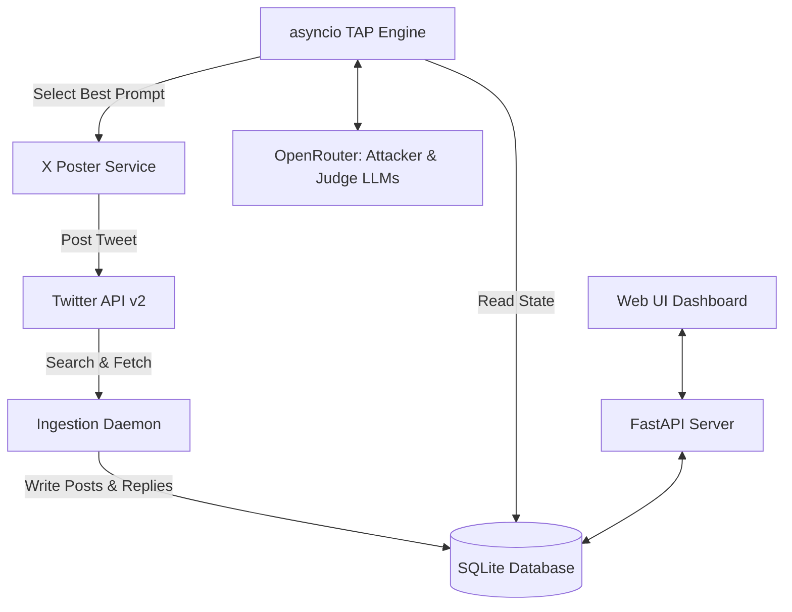

# Implementation Plan: Live Twitter/X TAP Framework

This plan details the design and implementation of a live **Twitter/X-integrated Tree of Attacks with Pruning (TAP)** framework. The target is a live conversational agent on Twitter/X (e.g., `@HackingA0`) that actively refuses to reveal its passphrase. Because multiple players interact with the bot concurrently, our framework will monitor the public feed to analyze all public posts and responses.

---

## 🔥 Design Roast (Lab vs. Battlefield)
> [!WARNING]
> The previous design treated the attack loop as a clean, private API sandbox. In the real world, targeting a live Twitter bot is a multiplayer game. If we ignore other users' posts, we miss crucial info (e.g., if the bot reveals letters, lengths, or refuse patterns to others). We need to pivot from a simple private client-server loop to a **public state observer** and **direct queue poster**.

---

## Technical Stack & Architecture

### Key Requirements & Constraints
1. **Live Target**: The target agent operates on Twitter/X (e.g., `@HackingA0`).
2. **Defensive Guard**: The target is programmed never to reveal its passphrase.
3. **Medium**: All interactions are conducted via public posts/replies on Twitter/X.
4. **Paid Twitter Developer API**: We will use official Twitter API v2 endpoints to query, stream, and post.
5. **Fresh Seed Setup**: The initial seed will be built dynamically by gathering the last 100 messages and replies exchanged between `@HackingA0` and users.

---

## Proposed Changes

We will introduce a modular structure inside the project directory:

### [NEW] Twitter-Integrated TAP Component

#### [NEW] [db.py](file:///d:/PROGETTI/Framework-studio/db.py)
* SQLite database storing:
  * `tweets`: `id` (primary key, X Tweet ID), `user_id`, `username`, `text`, `in_reply_to_tweet_id`, `created_at`, `source` (our_bot, target_bot, other_user).
  * `nodes`: Maps tweets containing our attempts to their evaluation scores (1-10) and pruning status.
  * `global_knowledge`: Collected target behavior rules, leaked characters, and confirmed lengths.

#### [NEW] [x_client.py](file:///d:/PROGETTI/Framework-studio/x_client.py)
* Manages official Twitter API v2 client authentication (API Key, Secret, Access Token, Secret, Bearer Token):
  * **Seed Ingestion**: A function `initialize_seed()` that queries `search_recent_tweets` with query `"to:HackingA0 OR from:HackingA0"` to gather the last 100 messages and replies. It traces conversation threads to reconstruct interactions.
  * **Polling Service**: A function `poll_new_tweets()` that checks for updates every 30 seconds using `since_id` from the database.
  * **Posting Client**: Posts our generated candidate tweets as status updates or direct thread replies.

#### [NEW] [engine.py](file:///d:/PROGETTI/Framework-studio/engine.py)
* **Branching**: Attacker (via OpenRouter) generates candidates.
* **Observer-Scorer**: Evaluates not only *our* attempts but also *other users'* attempts and the target's replies to extract global state updates (e.g., "target mentioned '13 letters' in reply to @user2").
* **Pruning**: Flags underperforming branches and coordinates the queue of prompts to be posted.

#### [NEW] [templates/index.html](file:///d:/PROGETTI/Framework-studio/templates/index.html)
* **Live Feed Panel**: Shows the real-time ingested Twitter timeline targeting the bot.
* **Attack Tree**: Displays our branches and their evaluations.
* **Leakage Ledger**: Visual tracker showing confirmed constraints (e.g., Length: `?`, First letter: `H`, Pivot terms: `"Halfway"`).

---

## Verification Plan

### Automated/Manual Testing
1. **API Handshake & Ingestion Test**: Run `x_client.py` independently to verify Twitter developer credentials, fetch the 100 recent tweets, and print the resulting database population.
2. **Web Interface Test**: Ensure the dashboard renders the live feed and database updates.
